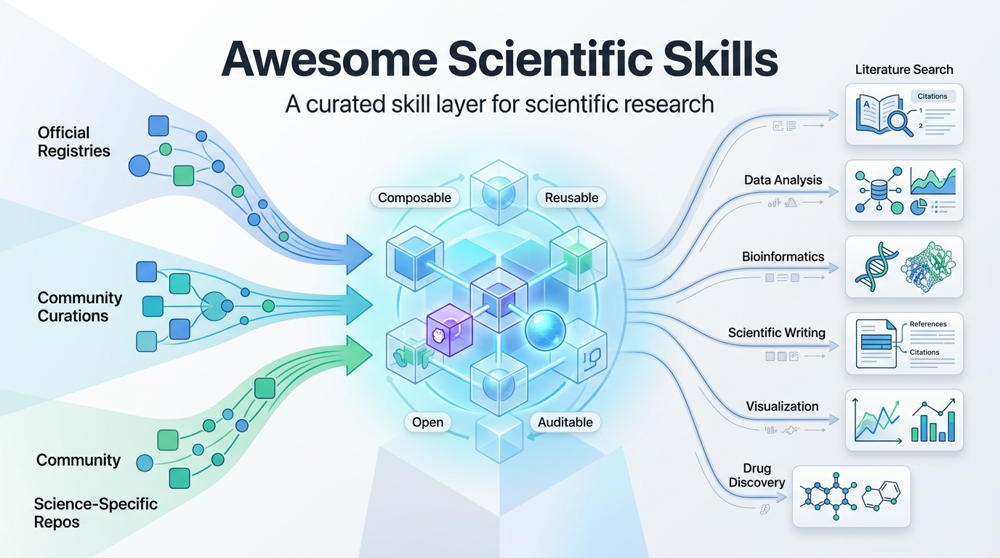

<div align="center">

# Awesome Scientific Skills 中文版

**一个面向科学研究的开放式精选 Agent Skills 集合——可 clone、可直接使用、可持续扩展。**

[](https://awesome.re)      
<a href="fig.jpg"></a>


**English README:** [readme.md](readme.md)

**配套工具** [Skiller](https://github.com/qishisuren123/skiller.git)   [skill-metric](https://github.com/ddd9898/skill-metric)

⭐ **如果这个仓库对你有帮助，欢迎点个 Star！**

[为什么做这个仓库？](#为什么做这个仓库) · [Skill 来源](#skill-来源) · [分类体系](#scientific-skill-categories) · [快速开始](#快速开始) · [贡献方式](#贡献方式)

</div>

---

## 问题

现在大量 Agent Skills 分散在官方 registry、社区仓库和个人项目里，粗略统计总量已达到约 30,000 个。研究者如果只是想完成一次基因本体富集分析、草拟一份基金申请书、或者绘制剂量反应曲线，不应该先从上万条技能里大海捞针，再自己把它们拼装成可用工作流。

## 目标

构建一个**可直接 clone 的高质量 scientific skills 仓库**，把与科学研究相关的技能集中起来，并按研究任务重新组织——覆盖生物信息学、化学信息学、数据分析、科学写作、文献检索等场景。

> **Phase 1（当前）**：先做精选链接集合，相当于“图书馆建成前的书单”。
>
> **Phase 2**：把筛选后的技能导入本仓库，并重组为统一目录结构。
>
> **Phase 3**：沉淀组合式 recipe，支持真实科研任务的多 skill 工作流。

---

## 为什么做这个仓库？

| 特性 | 对你的意义 |
|---|---|
| **科研优先的精选原则** | 每个 skill 都优先评估其是否真正服务于研究流程，而不是营销演示 |
| **完整可 clone** | 一次 `git clone`，拿到可本地使用的 skill 集合；不依赖账号、注册表或 API key |
| **跨 agent 兼容** | 可用于 Claude Code、Cursor、Codex、Gemini CLI，以及支持开放 [Agent Skills](https://agentskills.io) 标准的其他 agent |
| **开放且可审计** | 每个 skill 都来自公开源码，运行前可以自行审查 |

---

## Skill 来源

当前主要从两类上游仓库中挑选：

### 官方 Skill Registry

| 仓库 | 说明 |
|---|---|
| [anthropics/skills](https://github.com/anthropics/skills) | Anthropic 官方 Agent Skills 仓库，包含 skill-creator、web artifacts、MCP builder、brand guidelines 等 |
| [openai/skills](https://github.com/openai/skills) | OpenAI 官方 skill 定义仓库 |
| [huggingface/skills](https://github.com/huggingface/skills) | Hugging Face 面向模型工作流的 skill 集合 |
| [openclaw/clawhub](https://github.com/openclaw/clawhub) | OpenClaw 的社区 skill registry（13,700+ skills） |

### 社区精选集合

| 仓库 | Stars | 说明 |
|---|---|---|
| [VoltAgent/awesome-openclaw-skills](https://github.com/VoltAgent/awesome-openclaw-skills) | 25K+ | 从 ClawHub 过滤出的 5,400+ skills，是目前最大的社区精选列表之一 |
| [travisvn/awesome-claude-skills](https://github.com/travisvn/awesome-claude-skills) | 7K+ | 精选 Claude Skills 列表，并附带较完整的 progressive-disclosure 架构文档 |
| [ComposioHQ/awesome-claude-skills](https://github.com/ComposioHQ/awesome-claude-skills) | 39K+ | 面向 Claude Code / Claude.ai / API 的 50+ 已验证 skills，并集成 500+ 应用连接 |
| [heilcheng/awesome-agent-skills](https://github.com/heilcheng/awesome-agent-skills) | 2K+ | 跨 agent 的 skill 集合 |
| [InternScience/scp/skills](https://github.com/InternScience/scp/tree/main/skills) | 113 | 206 个科学研究相关 skills，覆盖药物发现、基因组学、蛋白工程、化学等方向 |
| [obra/superpowers/skills](https://github.com/obra/superpowers/tree/main/skills) | 68K+ | 面向高级用户的“superpowers”风格技能集合 |
| [vercel-labs/agent-skills](https://github.com/vercel-labs/agent-skills) | 21K+ | Vercel Labs 的实验性 agent skill 工具集 |
| [nextlevelbuilder/ui-ux-pro-max-skill](https://github.com/nextlevelbuilder/ui-ux-pro-max-skill) | 36K+ | 面向高保真前端生成的 UI/UX skill |
| [coreyhaines31/marketingskills](https://github.com/coreyhaines31/marketingskills) | 11K+ | 面向 CRO、文案、SEO、分析和增长流程的营销技能集合 |
| [agentskills/agentskills](https://github.com/agentskills/agentskills) | 12K+ | 开放 Agent Skills 标准的官方规范与文档 |
| [kepano/obsidian-skills](https://github.com/kepano/obsidian-skills) | 12K+ | 面向 Obsidian 工作流的 skills，覆盖 Markdown、Bases、JSON Canvas 和 CLI 集成 |
| [muratcankoylan/Agent-Skills-for-Context-Engineering](https://github.com/muratcankoylan/Agent-Skills-for-Context-Engineering) | 13K+ | 面向 context engineering 与生产级多 agent 系统的综合 skill 集合 |
| [ynulihao/AgentSkillOS](https://github.com/ynulihao/AgentSkillOS) | 233 | 支持从 90,000+ skills 中检索、编排和组合工作流的 skill orchestration 系统 |
| [OthmanAdi/planning-with-files](https://github.com/OthmanAdi/planning-with-files) | 15K+ | 为 Claude Code 提供持久化 Markdown planning 工作流 |
| [sickn33/antigravity-awesome-skills](https://github.com/sickn33/antigravity-awesome-skills) | 20K+ | 面向 Claude Code、Antigravity 和 Cursor 的大型跨 agent 集合（900+ skills） |
| [hesreallyhim/awesome-claude-code](https://github.com/hesreallyhim/awesome-claude-code) | 26K+ | Claude Code 生态精选列表：skills、hooks、commands、apps、plugins |
| [affaan-m/everything-claude-code](https://github.com/affaan-m/everything-claude-code) | 60K+ | 偏重性能、安全、记忆和研究工作流的 Claude Code 综合工具箱 |

### 科学研究专用来源

#### 专业领域工具（最高优先级）

| 仓库 | Stars | 说明 |
|---|---|---|
| [K-Dense-AI/claude-scientific-skills](https://github.com/K-Dense-AI/claude-scientific-skills) | 11.5K+ | **148+ scientific skills**，覆盖 250+ 数据库（PubMed、ChEMBL、UniProt、COSMIC、ClinicalTrials.gov、SEC EDGAR 等），是本项目科学技能层的重要基础 |
| [jaechang-hits/scicraft](https://github.com/jaechang-hits/scicraft) | 17 | **140 个经过验证的生命科学计算 skills**，包含 CI 校验结构和工作流导向参考 |

#### 学术写作

| 仓库 | Stars | 说明 |
|---|---|---|
| [K-Dense-AI/claude-scientific-writer](https://github.com/K-Dense-AI/claude-scientific-writer) | 937 | 支持实时文献检索和可验证引用的 deep research + scientific writing 工具 |
| [HughYau/AcademicForge](https://github.com/HughYau/AcademicForge) | 250 | 面向学术写作和研究流程的精选 skill 集合，强调高质量集成而非单纯数量 |

#### 文献检索

| 仓库 | Stars | 说明 |
|---|---|---|
| [yorkeccak/scientific-skills](https://github.com/yorkeccak/scientific-skills) | 21 | 支持自然语言科研文献检索，可跨 PubMed、arXiv、ChEMBL、DrugBank 等进行语义检索 |
| [Weizhena/Deep-Research-skills](https://github.com/Weizhena/Deep-Research-skills) | 90 | 结构化 deep-research workflow skill（大纲 + 调研），适合学术、技术和市场研究，并支持 human-in-the-loop |

#### 神经科学

| 仓库 | Stars | 说明 |
|---|---|---|
| [HughYau/neuroforge-skills](https://github.com/HughYau/neuroforge-skills) | 1 | 围绕主流 Python 工具链（Brian2、MNE-Python、Nilearn、SpikeInterface、pyNIBS）构建的神经科学技能集 |
| [HaoxuanLiTHUAI/awesome_cognitive_and_neuroscience_skills](https://github.com/HaoxuanLiTHUAI/awesome_cognitive_and_neuroscience_skills) | 9 | 覆盖 EEG/ERP、fMRI、建模等子方向的认知科学和神经科学技能集合；仓库说明中提到包含较多 AI 生成内容 |

---

## Scientific Skill Categories

下面是目标分类体系。来自上述来源的 skills 会映射到这些类别中。已勾选表示上游资源相对较丰富；未勾选表示仍有明显空白，后续会重点补充。

### Wet-Lab & Life Sciences

- [x] **Bioinformatics & Genomics** — 序列分析、单细胞 RNA-seq（Scanpy）、变异注释、系统发育、基因调控网络
- [x] **Cheminformatics & Drug Discovery** — 分子性质预测（RDKit）、分子对接、ADMET、化合物库检索（ChEMBL）
- [x] **Structural Biology** — 蛋白结构预测、PDB 获取、分子可视化
- [ ] **Proteomics & Metabolomics** — 质谱数据处理、代谢通路分析、峰识别
- [ ] **Clinical / Translational Research** — 临床试验检索、患者队列分析、真实世界证据工作流

### Computational Research

- [x] **Data Science & ML** — pandas、scikit-learn、PyTorch、统计分析、特征工程
- [x] **Simulation & Modeling** — 数值仿真、ODE/PDE 工作流、参数拟合
- [ ] **HPC & Workflow Systems** — Slurm、Nextflow、Snakemake、并行作业编排
- [ ] **Geospatial / Earth Science** — 遥感、GIS、栅格/矢量分析、气候数据处理

### Knowledge & Writing

- [x] **Literature Search & Retrieval** — PubMed、arXiv、Semantic Scholar、CrossRef、DOI 解析
- [x] **Scientific Writing** — 论文起草、基金申请、审稿辅助、引用管理
- [ ] **Knowledge Graphs** — 本体导航（Gene Ontology、MeSH）、实体链接、关系抽取

### Research Operations

- [x] **Data Wrangling** — 表格清洗、格式转换、缺失值处理
- [x] **Visualization** — 论文级图表（Matplotlib/Seaborn）、交互式 dashboard、图版排版
- [ ] **Reproducibility** — 环境快照、notebook 转 pipeline、数据溯源追踪
- [x] **Document Processing** — PDF 提取、DOCX/PPTX 生成、LaTeX 编译

### Quantitative & Financial Research

- [x] **Financial Data** — SEC EDGAR、Alpha Vantage、OFR Hedge Fund Monitor、Treasury 财政数据
- [ ] **Econometrics** — 时间序列分析、因果推断、面板数据方法

---

## 快速开始

### 方案 1：先浏览，再挑选

查看上面的 [Skill 来源](#skill-来源)，找到你需要的技能后，把对应 skill 文件夹复制到自己的项目里：

```
your-project/
└── .claude/
    └── skills/
        ├── pubmed-search/
        ├── rdkit-molecular-analysis/
        └── scientific-writer/
```

### 方案 2：直接 clone 科学技能栈（Phase 2）

```bash
# Coming soon：等本仓库完成 skills 整理后可直接使用
git clone https://github.com/InternScience/Awesome-Scientific-Skills.git
cp -r Awesome-Scientific-Skills/skills/ your-project/.claude/skills/
```

### 兼容性

这些 skills 遵循开放 [Agent Skills](https://agentskills.io) 规范，可用于：

- **Claude Code** — `/skills` 或 `.claude/skills/`
- **Cursor** — 读取 `.claude/skills/` 和 `.codex/skills/`
- **Codex** — `.codex/skills/`
- **Gemini CLI / Antigravity** — 通过 Agent Skills 标准兼容

---

## 筛选标准

并不是所有 skill 都会被收录。我们主要按以下标准筛选：

| 标准 | 要求 |
|---|---|
| **科研相关性** | 必须服务真实科研流程，而不是 demo 或玩具示例 |
| **来源质量** | 由可信团队发布，或由活跃维护的社区项目提供 |
| **文档完整度** | 具备清晰的 `SKILL.md`，说明用途、使用方式和依赖 |
| **开放许可** | MIT、Apache 2.0 或同等级宽松许可证 |
| **安全性** | 不接受未明确披露的网络调用或凭据采集行为 |
| **非冗余** | 对于功能重复的 skill，优先保留维护更好、质量更高者 |

---

## 贡献方式

欢迎贡献，但这个仓库会坚持“精选优先，数量其次”。

**如果你想推荐一个 skill：**

1. Fork 本仓库
2. 按如下格式把 skill 加到 `readme.md` 对应位置：
   ```
   | [skill-name](https://github.com/...) | Brief description of what it does |
   ```
3. 提交 Pull Request，并简要说明它为什么对科学研究有帮助

**我们希望看到的贡献：**

- 真正解决研究者日常问题的 skills
- 能与其他技能良好组合的 skills（例如检索 skill 的输出可以直接喂给分析 skill）
- 仍在由作者维护，而不是首发后就弃更的 skills

**我们暂不接受：**

- Crypto / blockchain / DeFi 类 skills（不在本仓库范围内）
- 没有文档的 skills
- 批量生成或疑似 spam 的 skills
- 强依赖专有后端且没有免费可用层的 skills

---

## 安全提示

> Skills 可以在 agent 运行环境中执行任意代码。**安装前请务必审查 skill 的 `SKILL.md` 以及随附脚本。** 本仓库做的是精选整理，不代表已完成安全审计；上游维护者也可能随时更新或修改技能内容。

---

## 路线图

- [x] Phase 1 — 按来源分类整理精选链接
- [ ] Phase 2 — 建立带评分和使用指标的社区 skill registry
- [ ] Phase 3 — 在 OpenClaw 和 Claude Code 中测试技能
- [ ] Phase 4 — 开发 skill creator，可从论文和 agentic trace 自动生成 skill

---

## 相关项目

这里也收录我们配套开源的 skill 生成与评测工具：

| 项目 | 说明 |
|---|---|
| [K-Dense-AI/claude-scientific-writer](https://github.com/K-Dense-AI/claude-scientific-writer) | 带实时文献检索与可验证引用的 deep research + scientific writing 工具 |
| [K-Dense-AI/claude-skills-mcp](https://github.com/K-Dense-AI/claude-skills-mcp) | 基于向量搜索的 skill retrieval MCP server |
| [qishisuren123/skiller](https://github.com/qishisuren123/skiller.git) | Skiller —— 自动化 Skill 生成工具，支持从对话记录或纯文本需求一键生成符合规范的 skill 包；在静态评估满分评分标准下验证，相比无技能 baseline 提升 57 个百分点 |
| [ddd9898/skill-metric](https://github.com/ddd9898/skill-metric) | skills 评价指标与仓库筛选工具，从三个维度严选优质 skills repo，并提供结构化质量评测指标 |
| [agentskills.io](https://agentskills.io) | 开放 Agent Skills 标准 |

---

## 许可证

本精选列表采用 [MIT](LICENSE) 发布。各个单独 skill 的许可证以其各自 `SKILL.md` 或原仓库声明为准。

---

<div align="center">
**如果这个仓库为你的科研工作节省了时间，欢迎点个 Star，并分享给你的实验室同伴。**

</div>
