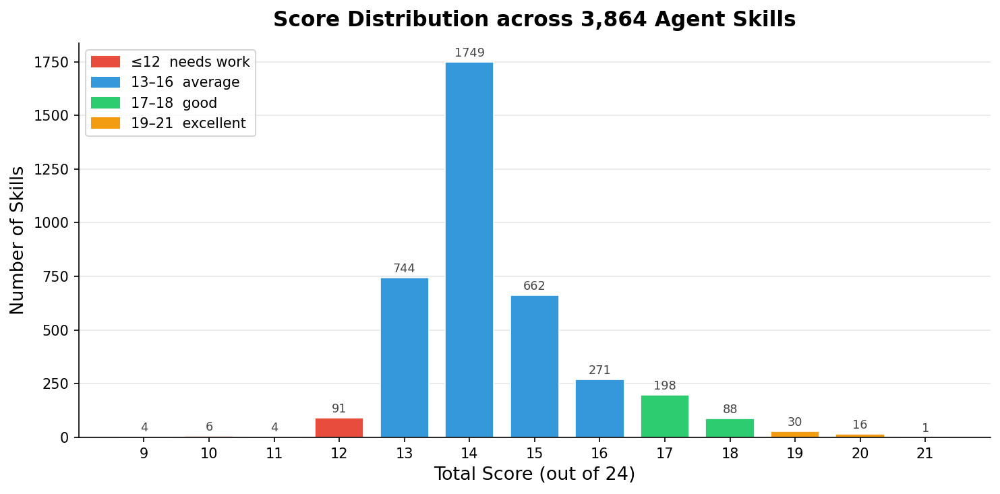
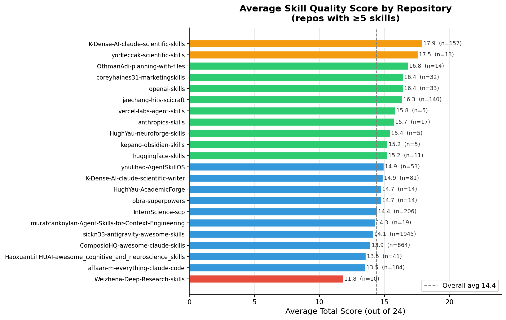
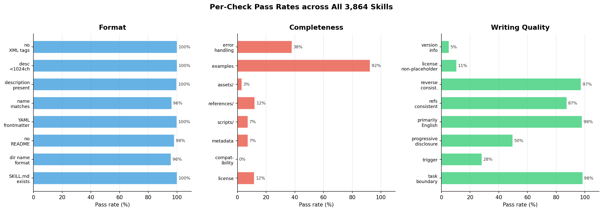

# Agent Skill Quality Benchmark — 3,864 Skills Evaluated

> **A large-scale static quality audit of publicly available agent skills,** scored against a principled 24-point rubric derived from Anthropic's official skill-building guidelines.

---

## Overview

We built `skill_quality_eval.py` — a zero-dependency static analyser that scores any `SKILL.md`-based agent skill on three dimensions: **Format**, **Completeness**, and **Writing Quality**.

To understand the landscape of real-world skill authoring, we collected **30 public repositories** containing agent skills and ran the evaluator across all of them.

| | |
|---|---|
| **Skills evaluated** | **3,864** |
| **Repositories** | 23 active (7 contained no `SKILL.md`) |
| **Evaluation dimensions** | Format · Completeness · Writing |
| **Max possible score** | **24 pts** (8 per dimension) |
| **Overall average** | **14.37 / 24** |
| **Top score** | **21 / 24** — `perplexity-search` (K-Dense-AI) |

---

## Score Distribution



The distribution is tightly concentrated in the **13–18** band (96.1 % of all skills), indicating that the community converges on a consistent baseline quality — but that there is significant headroom at the top end.

| Band | Count | Share |
|------|------:|------:|
| ≤ 12  — needs work | 105 | 2.7 % |
| 13–16 — average | 3,020 | 78.2 % |
| 17–18 — good | 286 | 7.4 % |
| 19–21 — excellent | 47 | 1.2 % |
| **All** | **3,864** | **100 %** |

---

## Repository Leaderboard



Average scores vary considerably across repositories — from **11.8** to **17.9** out of 24 — revealing that skill quality is highly correlated with the authoring conventions adopted by each project.

| Rank | Repository | Skills | Avg Score |
|------|-----------|-------:|----------:|
| 🥇 1 | `K-Dense-AI-claude-scientific-skills` | 157 | **17.9** |
| 🥈 2 | `yorkeccak-scientific-skills` | 13 | **17.5** |
| 🥉 3 | `OthmanAdi-planning-with-files` | 14 | **16.8** |
| 4 | `coreyhaines31-marketingskills` | 32 | 16.4 |
| 5 | `openai-skills` | 33 | 16.4 |
| 6 | `jaechang-hits-scicraft` | 140 | 16.3 |
| 7 | `vercel-labs-agent-skills` | 5 | 15.8 |
| 8 | `anthropics-skills` | 17 | 15.7 |
| … | *(15 more)* | … | … |

> Full per-skill scores are available in [`results_all_skills.csv`](results_all_skills.csv).

---

## Top-10 Individual Skills

| Rank | Skill | Repository | Score |
|------|-------|-----------|------:|
| 1 | `perplexity-search` | K-Dense-AI-claude-scientific-skills | **21/24** |
| 2 | `scikit-learn` | K-Dense-AI-claude-scientific-skills | 20/24 |
| 3 | `scientific-visualization` | K-Dense-AI-claude-scientific-skills | 20/24 |
| 4 | `scanpy` | K-Dense-AI-claude-scientific-skills | 20/24 |
| 5 | `rowan` | K-Dense-AI-claude-scientific-skills | 20/24 |
| 6 | `pufferlib` | K-Dense-AI-claude-scientific-skills | 20/24 |
| 7 | `neuropixels-analysis` | K-Dense-AI-claude-scientific-skills | 20/24 |
| 8 | `matplotlib` | K-Dense-AI-claude-scientific-skills | 20/24 |
| 9 | `imaging-data-commons` | K-Dense-AI-claude-scientific-skills | 20/24 |
| 10 | `generate-image` | K-Dense-AI-claude-scientific-skills | 20/24 |

---

## Dimension Deep-Dive



The per-check pass rates reveal **very different maturity profiles** across the three dimensions:

### Format — avg **7.90 / 8** (very strong)

The community has broadly adopted structural conventions. Almost every skill ships a valid `SKILL.md` with YAML frontmatter and a `description` field, and keeps descriptions concise and XML-free.

| Check | Pass rate |
|-------|----------:|
| `SKILL.md` exists & correctly named | 100.0 % |
| Kebab-case directory name | 95.8 % |
| No `README.md` inside skill dir | 98.1 % |
| YAML frontmatter present | 99.8 % |
| `name` matches directory | 96.3 % |
| `description` field present | 99.7 % |
| `description` < 1024 chars | 100.0 % |
| `description` has no XML tags | 100.0 % |

### Completeness — avg **1.72 / 8** (significant gap)

This is the weakest dimension overall. Most skills contain good inline examples (92.4 %) but are missing operational metadata such as `license`, `compatibility`, and `metadata` fields — and few include supplementary `scripts/` or `references/` directories.

| Check | Pass rate |
|-------|----------:|
| `license` field | 11.7 % |
| `compatibility` field | 0.2 % |
| `metadata` field | 7.4 % |
| `scripts/` subdir (non-empty) | 7.3 % |
| `references/` subdir (non-empty) | 12.1 % |
| `assets/` subdir (non-empty) | 3.0 % |
| Concrete examples in body | **92.4 %** |
| Error/exception handling in body | 37.9 % |

### Writing Quality — avg **4.75 / 8** (room for improvement)

Writing quality is mixed. Task-boundary clarity and English usage are near-universal, but fewer than half of skills include a clear trigger phrase or practise progressive disclosure by offloading detail to `references/` or `scripts/`.

| Check | Pass rate |
|-------|----------:|
| Clear task boundary in `description` | 98.5 % |
| Clear trigger phrase in `description` | 28.2 % |
| Progressive disclosure (body ≤ 5k chars) | 49.7 % |
| Content primarily in English | 98.0 % |
| `references/` / `scripts/` refs consistent | 87.4 % |
| Reverse consistency (dirs referenced in body) | 97.3 % |
| `license` is non-placeholder | 10.6 % |
| Version information present | 5.3 % |

---

## The Scoring Rubric

All scores are computed by [`skill_quality_eval.py`](https://github.com/ddd9898/skill-metric/blob/main/skill-metric/scripts/skill_quality_eval.py), a pure-stdlib Python script (no external dependencies for the core logic).  
The rubric is derived from Anthropic's [*The Complete Guide to Building Skills for Claude*](https://resources.anthropic.com/hubfs/The-Complete-Guide-to-Building-Skill-for-Claude.pdf).

```
Total Score = Format (max 8) + Completeness (max 8) + Writing (max 8) = 24 pts

Format:       starts at 8 pts; −1 per violation
Completeness: starts at 0 pts; +1 per satisfied item
Writing:      starts at 0 pts; +1 per satisfied item
```

For the full rubric see [`skill_metric_readme.md`](https://github.com/ddd9898/skill-metric/tree/main).

---


## Key Takeaways

1. **Structural conventions are well-established** — Format scores average 98.7 % of maximum, showing the community has embraced the `SKILL.md` + YAML frontmatter pattern.
2. **Operational metadata is the biggest gap** — `license`, `compatibility`, and `metadata` fields are present in fewer than 12 % of skills. Filling these fields would immediately raise the average score by 2–3 points.
3. **Writing quality separates the best from the rest** — The top-tier repositories (avg ≥ 17/24) consistently include trigger phrases, version information, and keep body content concise with supporting files in `references/` or `scripts/`.

